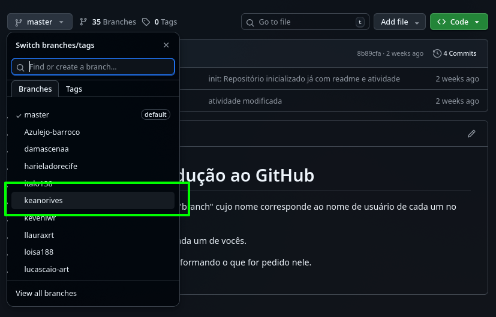
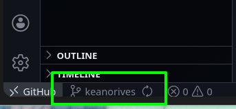
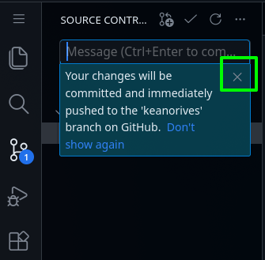
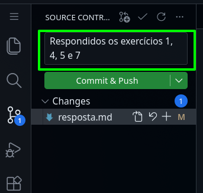

# Atividade 01 - Variáveis

As atividades deste módulo dizem respeito a variáveis em JavaScript. Sigam as instruções abaixo para a realização das atividades:

## Para responder as atividades

1. Cada aluno da turma possui uma "branch" cujo nome corresponde ao nome de usuário de cada um no github. Ao clicar no botão com o texto "master" acima da lista de arquivos deste projeto, aparece um menu onde você deve escolher a "branch" cujo nome é o mesmo que o nome de seu usuário no GitHub.  
  
  

2. Após selecionar sua branch, faça um dos dois passos abaixo (o resultado é o mesmo):
    - Aperte a tecla de ponto final no teclado, uma única vez
    ou
    - Se a opção acima não funcionar, no endereço da página onde tem "github.com" mude o ".com" para ".dev", e mantenha o restante do endereço da mesma forma.
    Ex: "github.com/viccalq/3c-01-variaveis" -> "github.dev/viccalq/3c-01-variaveis"

3. Espere o VSCode online carregar por completo antes de mexer no projeto. Demora um pouco.

4. Confirme se na parte de baixo a esquerda no VSCode online o nome da branch é o mesmo que o nome de seu usuário. Se não for, clique no nome que aparece na branch, e no menu que aparecer selecione a sua branch.  
  

5. As instruções para as atividades se encontram na próxima sessão (Formato dos exercícios). Quando terminar, volte para o passo 6 desta sessão.

6. Para salvar as modificações e enviar a atividade, clique no terceiro botão dos ícones na borda esquerda do VSCode para abrir um outro menu.  
  

7. Feche a mensagem que aparece sobre o commit.  
  

8. Escreva uma mensagem informando quais exercícios você respondeu da lista. Exemplo: "Respondidos os exercícios 1, 4, 5 e 7".  
  

9. Clique no botão "Commit & push" e espere um pouco. Após o botão ficar desabilitado, a atividade foi enviada.  
  

## Formato dos exercícios

1. As questões se encontram nos arquivos abaixo:
    - `ex-01-variaveis-nomes.js`
    - `ex-02-variaveis-tipos.js`
    - `ex-03-variaveis-escopo.js`
    - `ex-04-operadores-aritimeticos.js`
    - `ex-05-operadores-logicos.js`

2. Na sessão "Instruções da atividade" abaixo, vocês encontrarão explicações sobre a forma de responder cada exercício.

3. Os espaços para as respostas ficam logo abaixo das questões, no mesmo arquivo, como no exemplo abaixo:

```JavaScript
/* Exercício 01
 * 
 * Crie abaixo da linha com o texto "// Resposta" uma variável do tipo string (texto)
 * com o nome "var_01". Esta variável deve ser uma constante.
 */

// Resposta
const var_01 = "Este é um texto."
```

4. Algumas questões já terão o parte do código criado, bastando completar o restante de acordo com as instruções da questão.

5. Os nomes das variáveis, funções e afins ***DEVEM SER IDÊNTICOS AO SOLICITADO***. A avaliação automática busca as respostas dos exercícios pelo nome de cada item, e se este não estiver ***IDÊNTICO***, a resposta é considerada ***NÃO ENTREGUE***. Exemplo abaixo:

```JavaScript
/* Exercício 02
 * 
 * Crie abaixo da linha com o texto "// Resposta" uma variável do tipo number (número)
 * com o nome "VAR_exemplo_02". Esta variável NÃO pode ser uma constante.
 */

// Resposta
let var_exemplo_02 = 55 /* ERRADO */
let VARexemplo02 = 55 /* ERRADO */
let VAR_exemplo_02 = 55 /* Correto */
```

6. Ao final de alguns arquivos, existe um código começado com a linha `export {`. Este código ***DEVE SER MANTIDO DO JEITO QUE ESTÁ***. Se for alterado de qualquer forma, vocẽ corre o risco de ter as respostas não reconhecidas pelo avaliador automático.

7. Da mesma forma, se alguma variável ou valor tiver `export` na frente, mantenha o `export`.

## Instruções da atividade

1.  Somente pode ser feita com os colegas do grupo de Projeto Integrado
2.  No mínimo 2 pessoas por computador, no máximo 3 (exceto em caso de faltas)
3.  Cada exercício tem a seguinte estrutura:
        - Um resumo do assunto daquele exercício
        - Instruções de como responder as perguntas
        - Informação da quantidade mínima de perguntas para a nota máxima 
          naquele exercício
        - Os exercícios
4.  Sigam as instruções do que modificar ***e*** não modificar ***a risca***
5.  Vocês podem testar o código de vocês em qualquer momento
6.  O tempo para responder as questões se encerra 15 minutos antes do final da aula
7.  A quantidade total de exercícios é de 80 questões:
        - 20 do arquivo ex-01-variaveis-nomes.js
        - 20 do arquivo ex-02-variaveis-tipos.js
        - 10 do arquivo ex-03-variaveis-escopo.js
        - 20 do arquivo ex-04-operadores-aritimeticos.js
        - 10 do arquivo ex-05-operadores-logicos.js
8.  Cada exercício vale um máximo de 2 pontos de um total de 10 para a atividade
9.  A quantidade mínima de questões corretas para garantir os 2 pontos 
    para cada exercício é de:
        - 8 questões corretas para o ex-01-variaveis-nomes.js
        - 8 questões corretas para o ex-02-variaveis-tipos.js
        - 4 questões corretas para o ex-03-variaveis-escopo.js
        - 8 questões corretas para o ex-04-operadores-aritimeticos.js
        - 4 questões corretas para o ex-05-operadores-logicos.js
10. Pontos excedentes (a mais) em um exercício não contam para os outros
11. Pontos a mais apenas substituem a pontuação de questões erradas do mesmo exercício

## Dicas

1.  Leiam o resumo do assunto de cada exercício primeiro
2.  Para cada exercício, respondam primeiro o número mínimo de questões 
    necessárias e então avancem para o próximo exercício.
3.  Respondam questões extras apenas caso tenha sobrado tempo após 
    responder o mínimo de cada exercício

# Boa atividade
